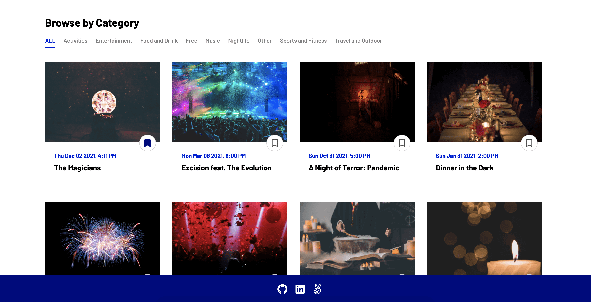

# Eventdark


### [Eventdark Live](https://eventdarkapp.herokuapp.com/)

Eventdark is an Eventbrite clone, curated for those whose comfort zones are in 
the dark. Users are able to browse events and filter by category, and when
logged in, can register for or bookmark events they are interested in.

## Features

* User authentication
* CRUD: Creating, reading, updating, and deleting events
* Event registrations and event bookmarking
* Ability to browse by category
* Ability to search for events by title or description

## Technologies Used

* Front-end
    * React
    * Redux
* Back-end
    * Ruby on Rails
    * PostgreSQL
* Cloud
    * Heroku

## Bookmarks
When logged in, users have the ability to bookmark or unbookmark events in several places:
1. On the main splash page
2. On the event show page
3. On an event show page's 'Similar Events'



```javascript
handleBookmark(e) {
    e.preventDefault();
    if (this.props.currentUser.id) {
        let bookmarks = this.props.event.bookmarks || {};
        let userId = this.props.currentUser.id;
        let bookmark = bookmarks[userId];
        if (bookmark) {
            this.props.deleteBookmark(bookmark.id)
                .then(() => this.props.fetchEvent(this.props.event.id));
        } else {
            this.props.createBookmark({ bookmark: { event_id: e.currentTarget.value } })
                .then(() => this.props.fetchEvent(this.props.event.id));
        }
    } else {
        this.props.history.push('/signin');
    }
}

bookmarkButton() {
    let bookmarks = this.props.event.bookmarks || {};
    let userId = this.props.currentUser.id;
    if (bookmarks.hasOwnProperty(userId)) {
        return (
            <button className="bookmarked" 
                value={this.props.event.id}
                onClick={this.handleBookmark}>
                <i className="fas fa-bookmark"></i>
            </button>
        )
    } else {
        return (
            <button className="bookmark"
                value={this.props.event.id}
                onClick={this.handleBookmark}>
                <i className="far fa-bookmark"></i>
            </button>
        )
    }
}
```

A bookmark or bookmarked icon is displayed conditionally, depending on whether
the user has bookmarked the event. It calls the ```handleBookmark()``` function
to either create or delete the bookmark if logged in. If not logged in, the 
user will be shown the signin page.

## Categories
Users can browse events on the splash page from a variety of categories:


```javascript
let filteredEvents;
    switch (this.state.index) {
        case 0:
            filteredEvents = events;
            break;
        case 1:
            filteredEvents = events.filter(e => e.category === 'Activities');
            break;
        case 2:
            filteredEvents = events.filter(e => e.category === 'Entertainment');
            break;
        case 3:
            filteredEvents = events.filter(e => e.category === 'Food and Drink');
            break;
        case 4:
            filteredEvents = events.filter(e => e.category === 'Free');
            break;
        case 5:
            filteredEvents = events.filter(e => e.category === 'Music');
            break;
    // ...

    filteredEvents = filteredEvents.map(event => (
            <EventIndexItem currentUser={currentUser}
                fetchEvent={fetchEvent}
                createBookmark={createBookmark}
                deleteBookmark={deleteBookmark}
                key={`filtered-${event.id}`}
                event={event}
                history={history}/>
        ));
```

Events are filtered based off its index in an array of categories - the
results are mapped and an index item is created for each one and shown
when the category tab is clicked on.

## Future Implementations

* Addition of location and utilization of Google Maps API to display map
